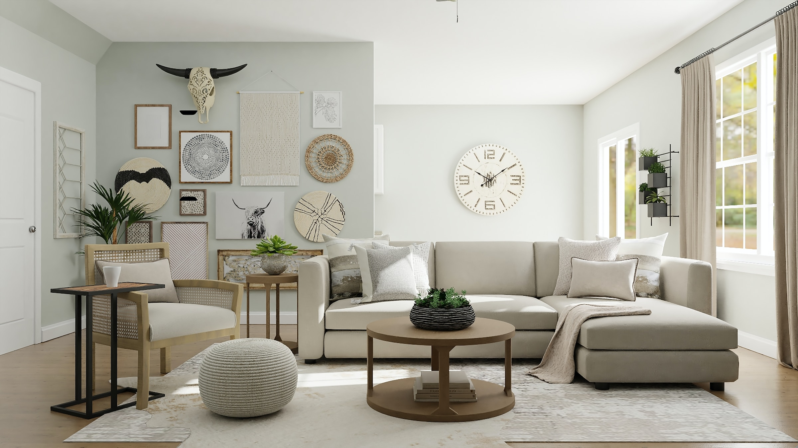
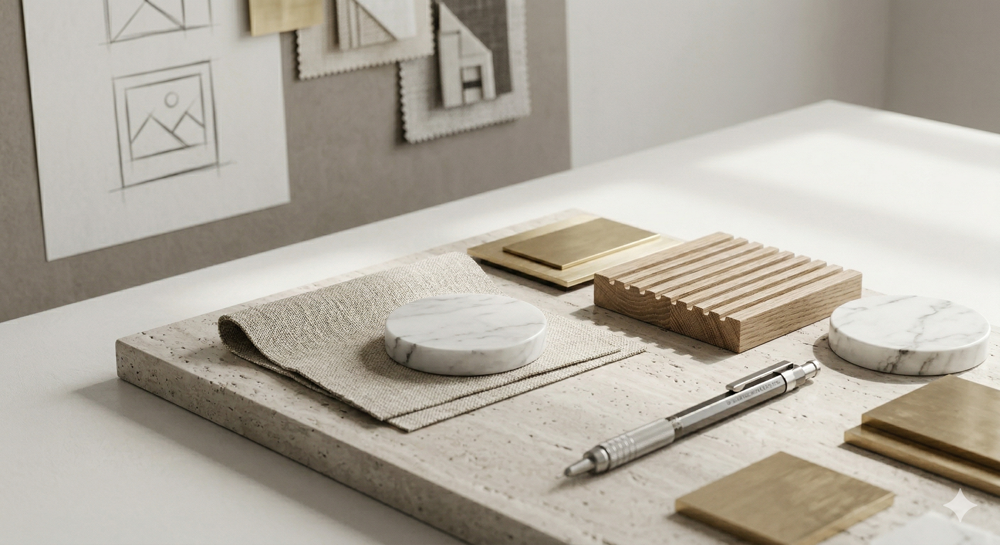

# 🏛️ Vishwakarmans

A premium web marketplace built with React and Vite that bridges the gap between clients and elite interior/commercial design professionals. The platform allows users to browse verified portfolios, compare expertise, and connect directly for collaborative projects.

## 📸 Exploring Design Categories

  
  

  <em>Showcasing curated materials for the boutique design experience.</em> 
  

## 🚀 Key Features

- **Role-Based Architecture:** Secure routing and dynamic dashboard rendering for Clients, Designers, and Administrators using `react-router-dom`.
- **Backend as a Service (BaaS):** Comprehensive integration with **Supabase** for user authentication, session persistence, and real-time PostgreSQL database management.
- **Serverless Edge Functions:** Utilizes Supabase Edge Functions (Deno/TypeScript) to securely bypass Row Level Security (RLS) for automated, secure designer onboarding and profile generation.
- **Staggered Scroll Animations:** A custom `RevealOnScroll` component utilizing the native `IntersectionObserver` API to orchestrate performant, premium fade-in animations.
- **Blazing Fast Performance:** Powered by Vite for instant Hot Module Replacement (HMR) and highly optimized production builds.

## 🛠️ Tech Stack

- **Frontend Framework:** React 19, Vite
- **Styling & UI:** Tailwind CSS, Framer Motion, Lucide React
- **Backend:** Supabase (Auth, Postgres)
- **Serverless:** Deno Edge Functions

## ⚙️ Setup & Installation

1. Clone the repository.
2. Install dependencies by running `npm install`.
3. Set up your Supabase project credentials in your environment variables.
4. Run `npm run dev` to start the Vite development server.
5. To deploy the edge functions, use the Supabase CLI: `supabase functions deploy admin-onboard`.
